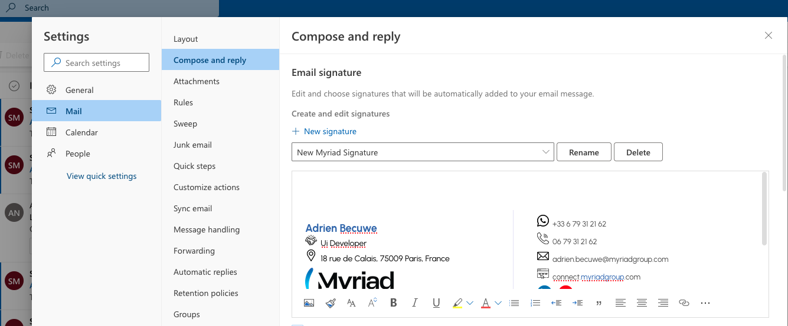

# Generator Myriad Email Signature

The page permit you to create your email siganture with the information you want
you can add your:
- Name
- Designation
- Location
- Phone Number (Optional)
- WhatsApp number(Optional)
- Emai 

##  How to use the new Email Signature

- Click on Copy Signature Button
- Go to https://outlook.office365.com/mail/
- Click on the settings icons top right 
- In the bottom click on View All Outlook settings

- In the sidebar menu go to Mail > Compose And Reply
- Credit a new signature or remove all data from the curent And pass the data you copy before the with button

